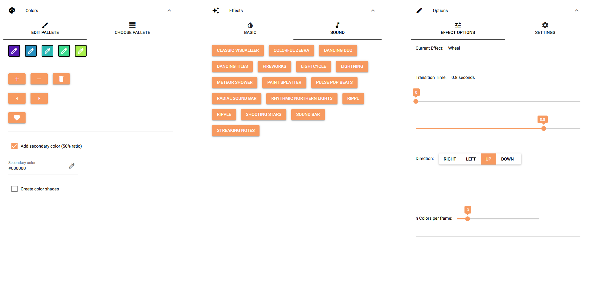
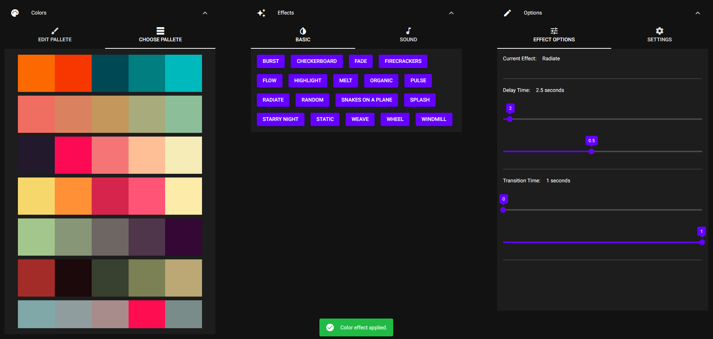

# Unofficial lightning control for Nanoleaf

## Idea
You can use this software to control your *Nanoleaf* lights in a more convenient way.

So you might ask, why just don't use the official *Nanoleaf* app for mobile or desktop? 
Well, I don't really like the app. I'm not a big fan of the concept that you are limited to the relatively low maximum amount of effects that can be stored locally on a device.

And for **each** effect you have to...
1. choose one color palette
2. select one effect
3. predefine the respective, optional effect parameters
4. And last but not least: to save the specific effect with a name

This process takes a lot of time, and you are not able to perform quick adjustments for an effect.

---

I have a completely different approach to control the *Nanoleafs*. My idea is to create the effects *live*, *on-the-go*, for that I take advantage of the [Nanoleaf Devices OpenAPI](https://forum.nanoleaf.me/docs) function to display effects temporary on the Panels without saving it as an Effect. 

In the user interface (powered by NiceGUI) you have the agony of choice about 1000 popular color palettes. Besides that you have an edit palette where you can adjust the colors and rearrange the order of the colors. You have also access to every Effect including their respective effect options. 

## Screenshots

### Light mode


### Dark mode


## Features
- easy-to-use, well structured, great usability
- switch between light and dark mode
- change ui accent color
- foldable sections
- access up to 1000 predefined color palettes
- access to all default effects and plugin effects that are also included in the official app
- access to respective effect parameters
- editable color palettes
	- change specific colors
	- add/remove specific colors
	- rearrange the order of the colors
- create 10 color shades based on one color with one click
- set a secondary color for a color palette
- Device settings will be saved in `settings.json`

## Setup guide
### I. Installation
1. Install Python

	Get it from the [official homepage](https://www.python.org/downloads/)

2. Download the repository

	*manually* from [here](https://github.com/RobinSchfr/Lightning-control-for-Nanoleaf/archive/refs/heads/master.zip)

	or with

	```bash 
	git clone https://github.com/RobinSchfr/Lightning-control-for-Nanoleaf.git
	```

3. Install all dependencies

	- Use `pip3` when you are using mac os
	```bash
	pip install -r requirements.txt
	```

### II. Usage
1. Launch the app
	- Use `python3` when you are using mac os
	- Make sure that you are in the project directory (change directory with `cd <dir>`)
    - The client which runs the app has to be in the same network as the Nanoleafs
	```bash
	python src/main.py
	```

	The app is now available through http://127.0.0.1:8080/ in your browser.
2. Device setup

	Go to `Settings` > `Developer options`
	1. Click `Get IP from device` (This may take up to 2 minutes.)
	2. Click `Create token`
	3. Click `Connect`

#### Now you are ready to go!

## Compatibility
The software especially the unit which creates the effects is only tested on *Nanoleaf Shapes*.

It might not work properly on *Nanoleaf Lines*, *Nanoleaf Canvas* or *Nanoleaf Light Panels*.

## Roadmap
- [x] feature "create color Shades"
- [x] feature "add secondary color" to a palette
- [ ] Refactoring for better readability of the codebase
- [x] embed the tools into the ui
- [ ] create executable with pyInstaller (first beta release)
- [ ] shortcuts for color + effect combinations
- [ ] option to save color palettes
- [ ] option to create snapshots (save all effects from device) and to upload effects on a device
- [ ] schedule: change palette/effect automatically after specific amount of time
- [ ] create lightshows (collection of effects → next effect on a specific timestamp of a song)
- [ ] philips hue integration
- [ ] add more languages for the ui

## Special thanks to the creators of
- [NiceGUI](https://github.com/zauberzeug/nicegui)
- [1000 color palettes](https://github.com/Jam3/nice-color-palettes/blob/master/1000.json)

## Contributing
Feel free to contribute something! 
This is my first *real* open source project. 
Looking forward to get some feedback!
